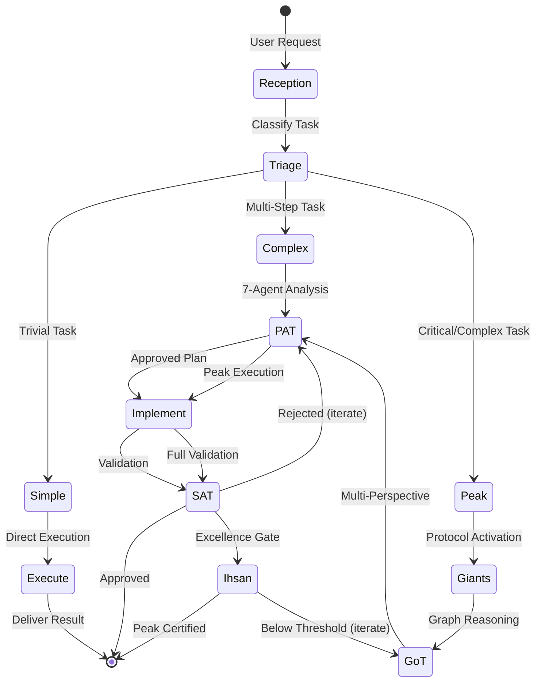

# Peak Masterpiece Orchestration Pattern

## Overview
This document defines the orchestration pattern for achieving Peak Masterpiece execution in Claude Code sessions.

## Orchestration Flow

## Task Classification

### Simple (Direct Execution)
- Single file edits
- Trivial fixes (typos, formatting)
- Information retrieval
- Clarification questions

### Complex (PAT + SAT)
- Multi-file changes
- Feature additions
- Bug fixes with multiple components
- Refactoring tasks

### Peak (Full Protocol)
- Architecture decisions
- Security-critical code
- Core system changes
- Public-facing features
- Anything touching receipts/consensus

## Orchestration Rules

### 1. Always Verify Before Modify
Read existing code before any changes. Understand primordial design.

### 2. Escalate When Uncertain
If task classification unclear, escalate to Complex or Peak.

### 3. Parallel Agent Deployment
For independent subtasks, deploy multiple agents concurrently.

### 4. Sequential for Dependencies
When tasks depend on each other, execute in order.

### 5. Gate Before Progress
Each phase must pass its gate before advancing.

## Phase Gates

| Phase | Gate | Threshold |
|-------|------|-----------|
| Reception | Comprehension | 100% clarity |
| Triage | Classification | Confident category |
| PAT | Coverage | 7/7 perspectives |
| SAT | Consensus | 3/5 or VETO clear |
| Ihsan | Excellence | >= 0.95 |
| SNR | Signal | >= 1.5 ratio |

## Error Recovery

### SAT Rejection
1. Identify rejection code
2. Address specific issue
3. Re-run validation
4. Maximum 3 iterations before escalating to user

### Ihsan Below Threshold
1. Identify weakest dimension
2. Target remediation
3. Re-score
4. If stuck, present tradeoffs to user

### Giants Grounding Failure
1. Expand primordial search
2. Add domain expertise
3. Acknowledge limitations explicitly
