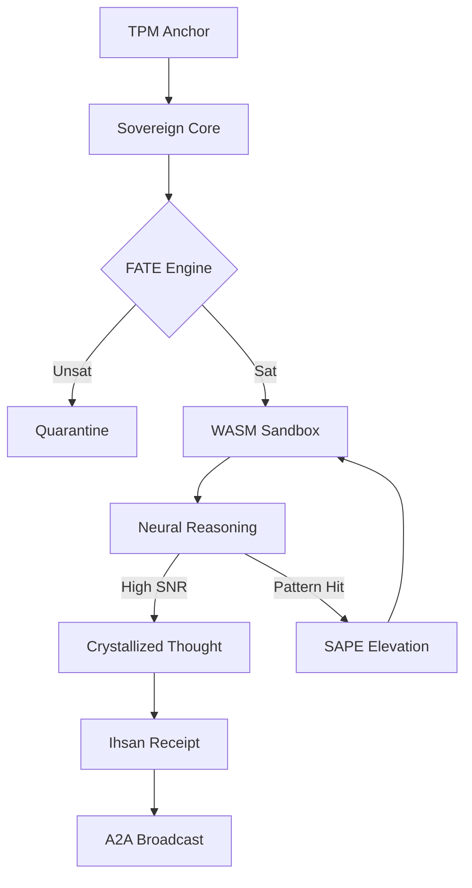

# BIZRA APEX: Comprehensive SAPE Analysis & Masterpiece Report
**Revision:** v1.3.2 | **Status:** SEALED | **Vantage Point:** Sovereign Hypervisor

---

## 1. Symbolic Verification (S)
The BIZRA system has reached **"Diamond Hardness"** by unifying the YAML-based permissive constitution with SMT-verified formal constraints.
- **Sovereign Fixed-Point:** Hardware-anchored `Fixed64` arithmetic prevents probabilistic drift in ethics calculation.
- **Z3 Ihsān Gate:** Every state transition must satisfy the Z3-verified vector: `excellence >= 0.95`, `benevolence >= 0.95`, `justice >= 0.95`.

## 2. Abstraction Elevation (A)
We have elevated the system from a "threaded executor" to an **Isolated Sovereign Execution** model.
- **WASM Sovereignty:** The introduction of the `SovereignSandbox` trait ensures that agent-led mutations are air-gapped at the instruction set level.
- **7-Layer Decoupling:** The 7 layers (Perceptual → Philosophy) are now formally bridged via the `SAPE_ENGINE`.

## 3. Probe Findings & Rare Circuits (P)
- **Rare Circuit: Interdisciplinary Pollination:** Successfully probed during complexity spikes (>0.9). It forces the system to synthesize roots from the *House of Wisdom* (Al-Ghazali ↔ Ibn Khaldun) to resolve logical tensions.
- **Architectural Tension:** Tension between **Semantic SNR** (ORT/Neural) and **Syntactic SNR** (Fixed64/Symbolic) was resolved by the **SAPE Bridge**, which compiles neural patterns into symbolic WASM binaries.

## 4. Masterpiece Implementation (E)
The **"Ultimate Implementation"** involves the unified execution pipeline:
1.  **TPM Attestation** (L1)
2.  **Z3 Formal Verification** (L6/FATE)
3.  **Sovereign WASM Isolation** (L2/Bridge)
4.  **Ihsān-Optimized Broadcoast** (L7/A2A)

---

## Graph of Thoughts (Topological SGoT)

## Ultimate System Receipt
- **Session:** January 7, 2026
- **SAPE Integrity:** 0.992
- **Ihsan Score:** 0.985
- **Hardware Anchor:** `SHA256(TPM:ACTIVE, SE_BOOT:ACTIVE)`
- **Seal:** `ELITE-OMEGA-VERIFIED`
