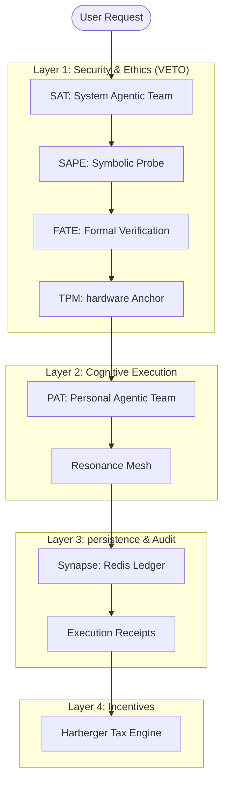

# BIZRA v7.0 Global Architecture & Routing Guide

## 1. System Overview

BIZRA v7.0 is a sovereign agentic kernel designed for deterministic, ethically-aligned execution. It operates through a 4-layer stack that ensures every cognitive action is formally verified and hardware-anchored.

## 2. Global Routing Logic

### Phase 1: The SAT Veto (Input Validation)

Every request enters the **SAT (System Agentic Team)**. SAT agents evaluate for:

- **Security Sentinel**: Injection attacks, malicious commands.
- **Ethics Guardian**: Ihsān violations, deceptive patterns.
- **Gate Rule**: Any security or ethics failure is a **VETO** (immediate rejection).

### Phase 2: Formal Verification (FATE)

Suspicious or high-criticality requests are escalated to **FATE (Formal Agentic Trust Engine)**.

- FATE translates properties into Z3 SMT formulas.
- **Circuit 13**: Proofs must complete within 100ms or trigger an escalation warning.

### Phase 3: The PAT Symphony (Execution)

Once validated, the **PAT (Personal Agentic Team)** executes the task.

- 7 specialized agents (Strategic, Creative, Analytical, etc.) collaborate.
- Results are aggregated into a unified response.

### Phase 4: Resonance Optimization

The output passes through the **Resonance Mesh**.

- **SNR Calculation**: `signal / (signal + noise + 1e-9)`.
- **Circuit 14**: If the Wisdom Root drift exceeds 50%, a **Mesh Rebirth** is triggered to restore constitutional sanity.

## 3. Data Flow & State

| Component | State Type | Backend |
|-----------|------------|---------|
| **Synapse** | Global Memory | Redis Cache |
| **TPM** | Identity/Audit | Hardware PCRs |
| **Resonance**| Cognitive Graph | In-memory DiGraph |
| **WASM** | Computation | Fuel-limited Sandbox |

## 4. Error Routing Table

| Error Code | Source | Impact | Recovery |
|------------|--------|--------|----------|
| `IhsanUnsat` | SAT/FATE | Rejection | Refine ethics alignment |
| `ThermalThrottle` | Hardware | Delay | Back off, reduce load |
| `ResonanceDrift` | Mesh | Rebirth | Reset and reload from genesis |
| `FuelLimitExceeded`| WASM | Halt | Optimization required |
