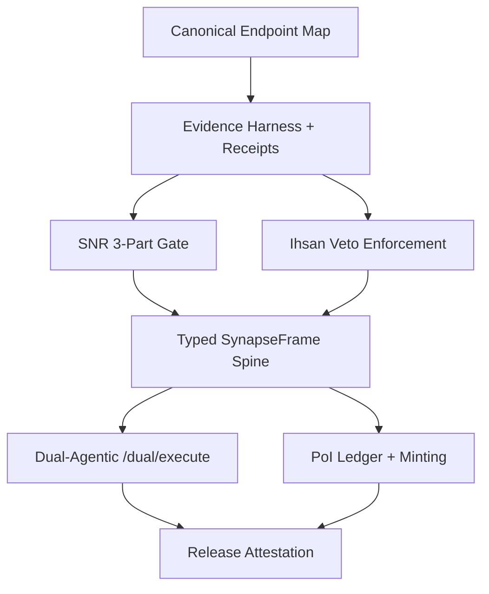

# Peak Masterpiece - Professional Elite Next Step

Purpose: deliver a minimal, verifiable, state-of-the-art Node-0 implementation that is
evidence-backed, fail-closed, and performance-bounded.

## Current Facts (Evidence-Backed)

From the latest live report:
- Kernel `/healthz` is reachable (HTTP 200) but `/health` and `/stats` are 404.
- TaskMaster API `/health` is reachable (HTTP 200) but `/stats` and `/api/poi/stats` are 404.
- Postgres accepts connections; `bizra_genesis` exists; `poi_ledger` table is absent.
- Chroma v2 heartbeat is OK; v1 endpoint is deprecated.
- Dual-agentic `/dual/execute` is not exposed on the running kernel.

Evidence: `docs/evidence/receipts/node0_health_report_20260104T043509Z.md`

## Interdisciplinary Design Frame (Standing-On-Giants Protocol)

1) **Formal Methods**: Z3/SAT for invariant enforcement, typed schemas for all boundary objects.
2) **Security**: SLSA provenance, SBOM (CycloneDX), signed attestations, secret scanning.
3) **Systems**: SLOs (p95 latency, error rate), backpressure, circuit breakers.
4) **Ethics**: Ihsan veto dimensions (Truth, Safety, Consent, Non-Harm) are non-negotiable.
5) **Economics**: PoI ledger with verified minting, auditable receipts per event.
6) **Product**: Stable endpoints and well-defined UX for agentic execution.
7) **Observability**: OpenTelemetry traces + Prometheus metrics for all core flows.

## Graph of Thoughts (High-SNR Execution Path)

## SNR Highest-Score Autonomous Engine (Fail-Closed)

Required gate (all 3 must pass):
- Evidence Coverage: % of atomic claims backed by receipts or hashes.
- Contradiction Pressure: NLI/consistency checks across GoT nodes.
- Compression Ratio: information density without loss of constraints.

Enforcement:
- If any component fails: downgrade or block; emit receipt with failure reason.

## Peak Masterpiece - Minimal Kernel Contract

1) **Typed Spine**: SynapseFrame is the only boundary object across trust layers.
2) **Fail-Closed Gates**: Ihsan + SNR + verification must pass before execution.
3) **Receipts First**: Every action emits a signed, hashable receipt.
4) **Dual-Agentic Canon**: `/dual/execute` is the primary execution endpoint.
5) **PoI Lifecycle**: `poi_ledger` schema, minting and verification receipts.

## Professional Next Step (Actionable, Minimal)

1) **Expose canonical endpoints**:
   - Kernel: keep `/healthz`; add `/health` and `/stats` with structured output.
   - Dual agentic: expose `/dual/execute` on the running kernel or proxy to the Rust server.

2) **PoI ledger activation**:
   - Apply DB migration to create `poi_ledger`.
   - Enable `/api/poi/stats` and a minting endpoint for verification.

3) **SNR/Ihsan enforcement**:
   - Implement the 3-part SNR gate and hard Ihsan veto dimensions.
   - Store gate outcomes as receipts.

4) **Attestation pass**:
   - Regenerate or reconcile the Genesis manifest to a single canonical hash.
   - Attach verification output as receipt.

## Acceptance Criteria (Release-Grade)

- `/healthz`, `/health`, `/stats`, `/dual/execute`, `/api/poi/stats` all return 200.
- `poi_ledger` exists; minting writes + receipts verified.
- SNR gate rejects low-evidence outputs deterministically.
- Genesis manifest hash is canonical and verified by receipt.

## Notes

This is the smallest professional path to a verified, elite-grade implementation.
Everything beyond this (advanced markets, hypergraph memory, new consensus layers)
is phase-2 after the gates are proven in evidence.
