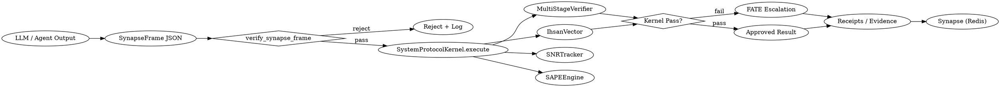

# Node0 Graph-of-Thoughts (GoT)

This graph reflects the current Node0 kernel flow with the added SynapseFrame gate.

## Mermaid

```mermaid
graph TD
    U[LLM / Agent Output] --> SF[SynapseFrame JSON]
    SF --> V{verify_synapse_frame}
    V -- reject --> R[Reject + Log]
    V -- pass --> K[SystemProtocolKernel.execute]
    K --> MV[MultiStageVerifier]
    K --> IV[IhsanVector]
    K --> SNR[SNRTracker]
    K --> SAPE[SAPEEngine]
    MV --> D{Kernel Pass?}
    IV --> D
    D -- fail --> F[FATE Escalation]
    D -- pass --> A[Approved Result]
    A --> P[Receipts / Evidence]
    F --> P
    P --> SYN[Synapse (Redis)]
```

## DOT


