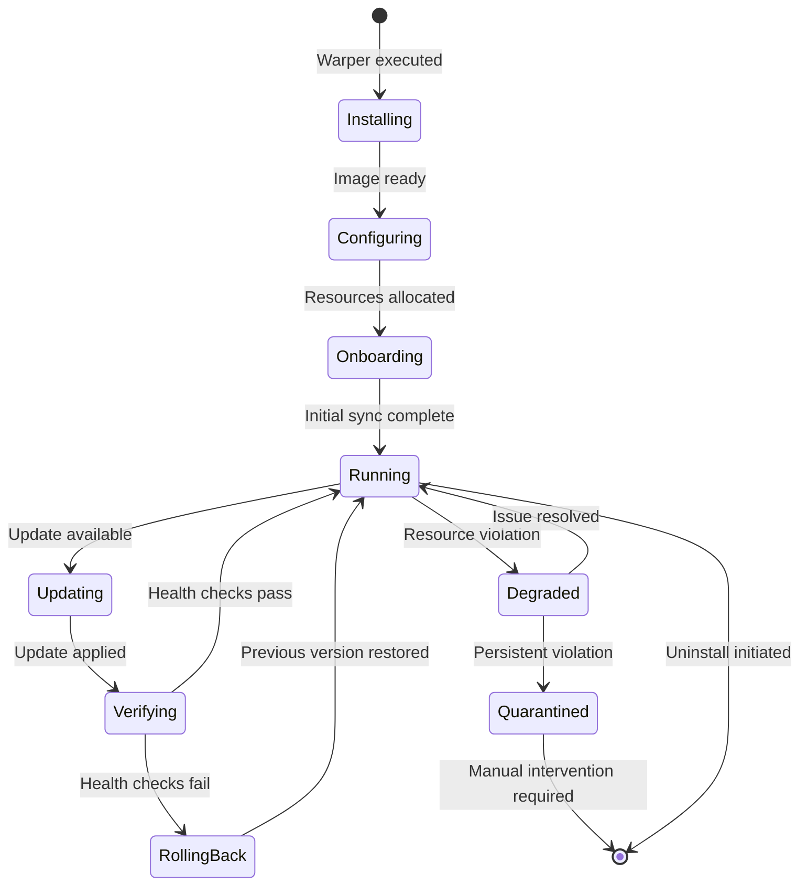

# BIZRA Node Appliance Spec (BNAS) v0.1

### 1.0 Appliance Definition

```
NODE TAXONOMY:
├── NODE₀ (Genesis)
│   ├── Role: Development, Testing, Governance Origin
│   ├── Platform: Physical/Virtual machine with full dev tooling
│   └── Access: Developers, Core Team, Governance Council
│
└── NODE₁⁺ (Product Appliance)
    ├── Role: Network Participation, Resource Contribution, Economic Activity
    ├── Platform: Isolated VM/Container with fixed resource dedication
    └── Access: General Public (no coding required)
```

### 1.1 Appliance Boundary Specification

**MVP Path (Containers-first for speed):**
```yaml
# Containerized Appliance Spec
appliance:
  type: "container"
  runtime: "docker/podman"
  isolation: "namespace + cgroups"
  security_profile:
    - seccomp: "default"
    - apparmor: "enforced"
    - capabilities: "dropped"
  resource_dedication:
    cpu: "quota + period enforcement"
    memory: "hard limit with OOM killer"
    storage: "volume mounts with quotas"
    network: "rate-limited bridge"
```

**Production Path (VM-first for mass adoption):**
```yaml
# VM Appliance Spec
appliance:
  type: "vm"
  hypervisor: "host-native"
  isolation: "hardware-assisted"
  platforms:
    windows: "Hyper-V + WSL2"
    macos: "Virtualization.framework"
    linux: "KVM + libvirt"
  resource_dedication:
    cpu: "dedicated cores/vCPUs"
    memory: "reserved RAM"
    storage: "virtual disk with TRIM"
    network: "virtio-net with QoS"
```

### 1.2 Resource Contract (Non-Negotiable)

```json
{
  "resource_contract": {
    "tier": "standard",
    "guarantees": {
      "compute": {
        "cpu_cores": 4,
        "cpu_percent": 30,
        "guarantee": "best-effort"
      },
      "memory": {
        "reserved_gb": 8,
        "max_gb": 12,
        "swap": "disabled"
      },
      "storage": {
        "root_gb": 50,
        "data_gb": 100,
        "iops_min": 1000
      },
      "network": {
        "bandwidth_mbps": 100,
        "monthly_gb": 500,
        "priority": "best-effort"
      }
    },
    "enforcement": {
      "mechanism": "cgroups/kvm-limits",
      "monitoring": "continuous",
      "violation_action": "graceful_degradation"
    }
  }
}
```

### 1.3 Core Runtime Architecture

```
APPLIANCE RUNTIME ARCHITECTURE:
┌─────────────────────────────────────────────────────────┐
│                 CONTROL PLANE (Orchestrator)            │
├─────────────────────────────────────────────────────────┤
│ • Lifecycle Manager (install/update/rollback)          │
│ • Resource Contract Enforcer                           │
│ • Policy Engine (Ihsān gates)                         │
│ • Telemetry & Diagnostics                              │
└────────────────────────────┬────────────────────────────┘
                             │
┌────────────────────────────▼────────────────────────────┐
│                COGNITIVE PLANE (Agents)                 │
├─────────────────────────────────────────────────────────┤
│ • PAT Gateway (Personal Agentic Team)                  │
│ • SAT Gateway (System Agentic Team)                    │
│ • LLM Runtime (DeepSeek/Claude interface)              │
│ • Tool Execution (MCP server)                          │
└────────────────────────────┬────────────────────────────┘
                             │
┌────────────────────────────▼────────────────────────────┐
│                  PROOF PLANE (Trust)                    │
├─────────────────────────────────────────────────────────┤
│ • PoI Receipt Generator                                │
│ • Attestation Service (TPM/software)                   │
│ • Fraud Detection Engine                               │
│ • Audit Log Manager                                    │
└────────────────────────────┬────────────────────────────┘
                             │
┌────────────────────────────▼────────────────────────────┐
│                  DATA PLANE (Storage)                   │
├─────────────────────────────────────────────────────────┤
│ • Refinery v1 (safe ingestion)                         │
│ • Vector/Graph Storage (local first)                   │
│ • Provenance Tracker (lineage)                         │
│ • Cache Manager (LRU + compression)                    │
└─────────────────────────────────────────────────────────┘
```

### 1.4 Installation & Update Model

```bash
# Installation Sequence
1. Warper downloads → verifies signature → extracts
2. Hardware introspection → resource recommendation
3. Appliance image download → verification
4. Resource contract acceptance → enforcement setup
5. Initial configuration → identity generation
6. First boot → onboarding completion

# Update Model
update_channels:
  stable:
    auto_update: true
    rollback_window: "24h"
    testing_requirement: "extensive"
  
  beta:
    auto_update: opt-in
    rollback_window: "1h"
    testing_requirement: "moderate"
  
  alpha:
    auto_update: manual
    rollback_window: "immediate"
    testing_requirement: "minimal"
```

### 1.5 Node States & Transitions


